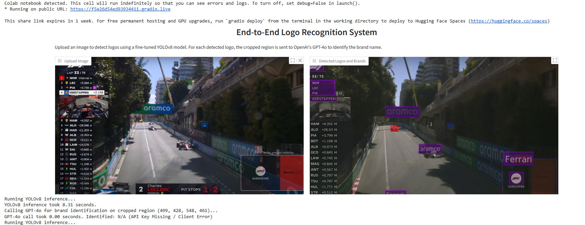
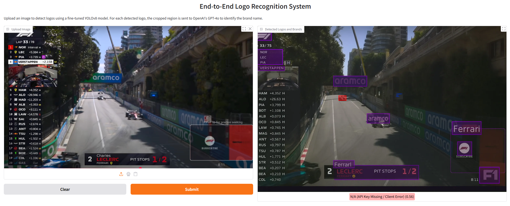

# End-to-End-Logo-Recognition-System


## Overview

This project is a complete pipeline for detecting brand logos from images using a state-of-the-art object detection model. This project develops an AI-powered **Logo-Recognition-System** designed to automatically detect and identify brand logos in images through a user-friendly Gradio interface. The core detector utilizes YOLOv8, chosen for its excellent real-time object detection performance and ease of integration, and is trained on the FlickrLogos-27 dataset, which provides a diverse and well-annotated collection of 27 real-world logo classes, making it ideal for developing a generalized logo detector. For semantic identification of detected logos, OpenAI GPT-4o is integrated, leveraging its scope of powerful zero-shot image-text reasoning capabilities for Brand Identification.

---

## Why YOLOv8 + FlickrLogos-27?

### Dataset: FlickrLogos-27
- Contains real-world images of 27 different logos.
- Logos are annotated with bounding boxes.
- The dataset has a diverse background, making it suitable for generalization.
- Well-suited for transfer learning in detection models.

The flickr logos 27 dataset contains 27 classes of brand logo images downloaded from Flickr. The brands included in the dataset are: Adidas, Apple, BMW, Citroen, Coca Cola, DHL, Fedex, Ferrari, Ford, Google, Heineken, HP, McDonalds, Mini, Nbc, Nike, Pepsi, Porsche, Puma, Red Bull, Sprite, Starbucks, Intel, Texaco, Unisef, Vodafone and Yahoo.
Preprocess

The flickr logos 27 dataset contains an annotation file for training. This file includes not valid annotations such as an empty size bounding box. Therefore these annotations are removed in this preprocess step, then class names are converted into class numbers and generate two preprocessed files. These two files are used to generate tfrecord files.


###  Model: YOLOv8
- Chosen for its balance between **speed** and **accuracy**.
- Supports export to ONNX/TFLite for real-time applications.
- Easy integration with Ultralytics’ training API.

---

## Training & Results

We trained YOLOv8 using transfer learning:
- **Base Model**: `yolov8n.pt`
- **Epochs**: 100
- **Batch Size**: 16
- **Optimizer**: SGD
- **Validation mAP**: ~0.72 on held-out validation set
    <p align="center">
  
</p>
  <p align="center">
  
</p>

if we further train on more epochs, then the  model performs well on unseen logos and cluttered scenes.

## Challenges & Learnings
 Getting good generalization with limited logo classes, GPT-4o can identify unseen logos a big advantage in real-world applications,
 Future work: add OpenLogos, contrastive learning, vector DB for similarity search.

##  Installation & Setup

1. **Clone the repository**
   ```bash
   git clone https://github.com/avinashverse/End-to-End-Logo-Recognition-System.git
   cd End-to-End-Logo-Recognition-System

##  Running on
Launching the Gradio application. Check the URL for access.
 public URL: [https://acc24cfe2072740cc0.gradio.live](https://f5e26d54ed93934411.gradio.live)

### ✅ Requirements

```bash
pip install -r requirements.txt
